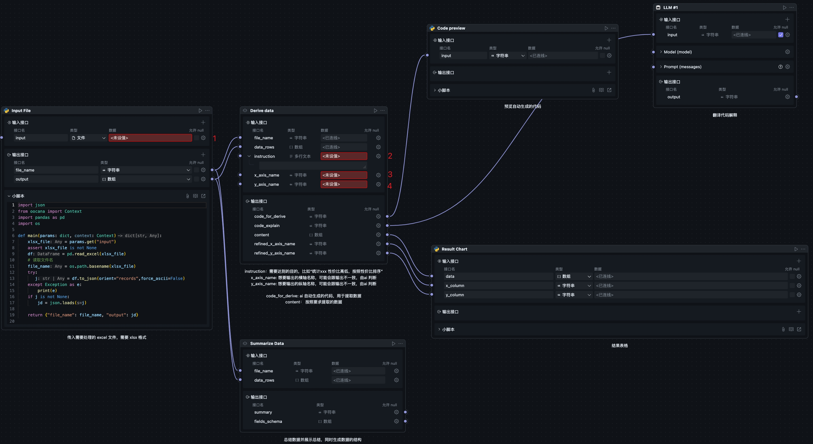

# data-formulator

该项目基于 [microsoft/data-formulator](https://github.com/microsoft/data-formulator) 软件修改而来。

该项目用于将用户上传的表格类数据进行分析后，按照用户意愿进行自定义格式化输出。
项目利用 AI 分析用户意图，并将用户意图转化为代码，最后执行代码生成用户所需的格式化数据并以图标形式展示。

输入文件表格式应该是二维表，表头如果是复杂结构可能会导致结果不准确。请自行整理表头。

## Flow
###  process-xlsx-data-and-display-chart

接收一个xlsx 格式的文件，将其内容按照用户的要求进行格式化，并以图表的形式展示。flow 的输入有以下几个：

1. input: 输入文件地址，文件目前需要时xlsx 格式，内容需要是表格的格式
2. instruction: 用户需要达成的目的，比如统计每个地区的销售额，或者统计每个地区的销售额占总销售额的比例
3. x_axis_name: 输出图表的横轴名，名称在ai 判断后，如果与原表的列名含义一致，就会改为原表的列名
4. y_axis_name: 输出图表的纵轴名，名称在ai 判断后，如果与原表的列名含义一致，就会改为原表的列名

最终flow 会输出一个图表，图表的横轴和纵轴名是用户指定的，图表的内容是根据用户的指令生成的。ai 会根据用户的指令生成代码，然后执行代码生成图表。
如果代码执行失败，flow 会自动修改代码并重试，重试次数为 1 次。

## Shared Block
* derive-data
用户可以自行指定输出表格的横纵轴名称，同时可以自定义要求。AI 会根据输入的数据判断如何达成要求，生成代码并自动执行，最终输出符合用户要求的图表数据结构。
代码运行失败会自动修改代码，重试次数为 1 次。

* summarize-data
总结输入数据（数组格式），大致描述输入是记录的什么内容，同时自动判断输入数据的格式。