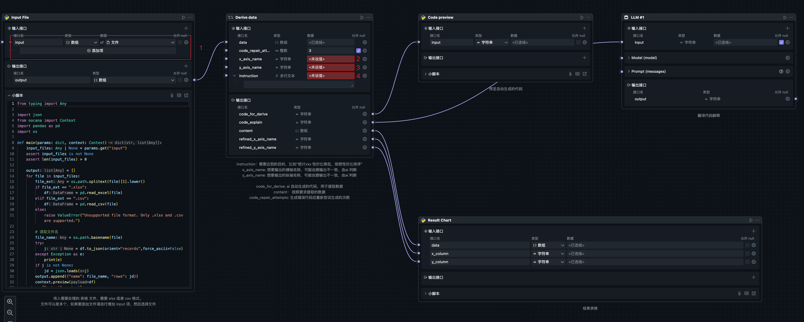

# data-formulator

This project is modified from [microsoft/data-formulator](https://github.com/microsoft/data-formulator).

This project is designed to analyze tabular data uploaded by users and format it according to user preferences for custom output.
The project uses AI to analyze user intent, translates it into code, and executes the code to generate formatted data displayed as charts.

The input file should be in a tabular format. Complex header structures may lead to inaccurate results. Please organize the headers accordingly.

## Flow
### process-xlsx-data-and-display-chart

Accepts an xlsx file, formats its content based on user requirements, and displays it as a chart. The flow has the following inputs:

1. input: An array of input file paths. Multiple files can be processed simultaneously. Currently, files must be in xlsx or csv format with tabular content.
2. x_axis_name: The name of the x-axis in the output chart. If the AI determines it matches a column name in the original table, it will use the original column name.
3. y_axis_name: The name of the y-axis in the output chart. If the AI determines it matches a column name in the original table, it will use the original column name.
4. instruction: The user's goal, such as calculating sales by region or the proportion of sales per region to total sales.

The flow outputs a chart with user-specified x and y-axis names, generated based on the user's instructions. The AI generates and executes code to produce the chart.
If the code fails, the flow automatically modifies it and retries up to 3 times.

## Shared Block
* derive-data
Users can specify the x and y-axis names for the output table and define custom requirements. The AI determines how to meet these requirements, generates code, and executes it to produce the desired chart data structure.
Code execution failures trigger automatic modifications and retries, up to 3 times.

* summarize-data
Summarizes input data (in array format), describing what the data records and automatically determining its format.